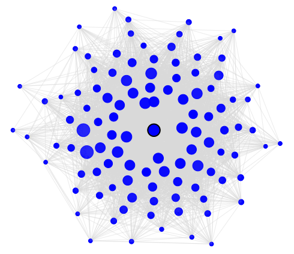

The edgefinder package is used to find edges in gene networks using co-expression
data. The input to the program is a normalized expression matrix, with genes (nodes)
in the rows, and samples in the columns.
The program calculates the pair-wise correlations, performs Fisher's Z 
transformation, and fits the L2N model to the transformed data. L2N is a mixture
model with three components: the uncorrelated pairs belong to the null component
which is assumed to be normally distributed, and the correlated pairs belong to one
of the two non-null components which are assumed to follow lognormal distributions.

Typical datasets consist of hundreds, or thousands of genes, and hence a very
large number of pairs. Therefore, edgefinder randomly selects a subset of the pairs (the
default number of pairs is 20,000), fits the L2N model to the subset, and calculates
the component probabilities for *all* possible pairs.
Using the posterior probabilities, edgefinder determines which pairs are
highly correlated while controlling the false discovery rate.
Note that edgefinder makes no assumptions about the structure of the network.

The edgefinder package depends on the 'Matrix' package, to allow for efficient
storage and computation of large co-occurrence matrices. For simulating datasets
we used the 'huge' and 'MASS' packages, but they are not required when
using edgefinder.

# Real data examples

We use a publicly available dataset from 
https://www.ncbi.nlm.nih.gov/sites/GDSbrowser?acc=GDS4430
(Horev G, Ellegood J, Lerch JP, Son YE et al. Dosage-dependent phenotypes in models 
of 16p11.2 lesions found in autism. Proc Natl Acad Sci U.S.A. 2011, Oct. 
11;108(41):17076-81. PMID: 21969575).

The dataset contains three groups: wild type (2 copies of 16p11.2),
deletion (1 copy), and duplication (3 copies).
We focus on a subset of 3,454, genes which were found to be differentially
expressed when comparing the wild-type and duplication groups (using an 
FDR threshold of 0.05.) We fit the
L2N model to this set of genes in each group, and compare the properties
of the two networks. First, we load the wild-type data (WT).
WT is a matrix with 3454 rows (genes) and 15 columns (samples) from
the wild-type group.


```
library("edgefinder")
# Wild-type first:
data(WT)
WTres <- edgefinder(WT, ttl = "Wild Type")
shortSummary(WTres)
```

The **edgefinder** function fits the L2N model to the data, and plots the fitted mixture distribution:


The function **shortSummary** produces the following output:

```
No. nodes = 3,454 
Max no. edges = 5,963,331 
No. edges detected = 80,332 
p1 = 0.0942 
p2 = 0.0185 
Est. FDR <= 0.00997 
```

Note that the estimated FDR is calculated based on the fitted L2N model.
The default FDR threshold used by the edgefinder function is 0.01, and in this case, the
empirical FDR is very close to the level set by the user. If the empirical FDR is too 
high, you may increase **LOvals** from its default value (30). This will result in larger
(stricter) thresholds for determining significant correlations, and will decrease the
proportion of false discoveries.
The FDR threshold (the **BHthr** parameter) should be set according to the number of edges.
In this example, the algorithm finds 80,332 edges, and an FDR of 0.01 means that
at most 800 of the detected edges may not be true discoveries. If this number of edges 
is too large in the sense that it may affect our inference about the network structure,
or a subsequent gene enrichment analysis, we could lower the FDR threshold.

The function **graphComponents** finds clusters of genes. To do that, it takes as input an 
adjacency (0/1) matrix  (e.g. WTres$AdjMat in our example.) To find clusters it first
calculates a centrality for each node, using the formula (type\*CC+1)\*deg where 
deg is the degree of the node, and CC is its clustering coefficient (CC). **type** is set 
by default to 1. When it is set to 0, the centrality measure is just the degree of
the node. Setting type=1 means that we assign a higher value to nodes that not only have
many neighbors, but the neighbors are highly interconnected. For example, suppose we 
have two components with k nodes, one has a star shape, and the other is a complete 
graph. With type=0 both graphs will get the same value, but with type=1 the complete 
graph will be picked by the algorithm first.
You can also set a minimum centrality value (the parameter **minCtr**) to determine the
smallest possible cluster size.

The function returns a data frame with the following information about each node:
a label (e.g. gene name), degree, clustering coefficient, centrality measure,
cluster number, iscenter (1 for the node was chosen as the cluster's center, 0 otherwise),
the number of edges from the node to nodes in the same cluster the number of edges 
from the node to nodes NOT in the same cluster, and the standardized Manhattan distance 
to the central node in the cluster (in terms of the number neighbors they do not have
in common.)

```
WTComp <- graphComponents(WTres$AdjMat)
head(WTComp)

  labels degree        cc      ctr clustNo iscenter intEdges extEdges  distCenter
1      1    251 0.5999044 401.5760       1        0      187       64 0.072958888
2      2      0 0.0000000   0.0000       0        0        0        0 0.000000000
3      3    202 0.7217378 347.7910       1        0      164       38 0.072090330
4      4    202 0.5819910 319.5622       4        0       98      104 0.008396063
5      5      0 0.0000000   0.0000       0        0        0        0 0.000000000
6      6      9 0.6944444  15.2500       0        0        0        0 0.000000000
```

The function **summarizeClusters** returns summary statistics about each cluster.
It prints the number of nodes, edges, clusters and unclustered nodes to the screen,
and returns a matrix with cluster number, number of nodes in the cluster, 
fivenum summary for the degrees of nodes in the cluster, and fivenum summary for
the percentage of edges that are within the cluster.

```
summtab <- summarizeClusters(WTComp)
head(summtab[,1:7])
head(summtab[,c(1:2,8:12)])

Num of nodes: 3454 
Num of edges: 80332 
Num of clusters: 72 
Num of unclustered nodes: 1837 

     Cluster Nodes degreeMin degreeQ25 degreeMedian degreeQ75 degreeMax
[1,]       1   374        59     222.0          257     299.0       373
[2,]       2    69        17      96.0          134     164.0       234
[3,]       3    39         2      53.5           74     122.5       209
[4,]       4   107        25     108.0          130     155.5       209
[5,]       5    35        26      58.5           80     109.0       154
[6,]       6    19        17      45.5           80     108.5       133


     Cluster Nodes pctInClstMin pctInClstQ25 pctInClstMedian pctInClstQ75 pctInClstMax
[1,]       1   374   0.52073733   0.78536585       0.8452080    0.9083969    1.0000000
[2,]       2    69   0.07109005   0.23952096       0.3061224    0.4226804    0.8235294
[3,]       3    39   0.03571429   0.09923455       0.1358025    0.2197585    1.0000000
[4,]       4   107   0.18750000   0.44693586       0.5555556    0.6298886    0.8529412
[5,]       5    35   0.10344828   0.21717172       0.2777778    0.3584826    0.7692308
[6,]       6    19   0.06666667   0.10270206       0.1262136    0.1594156    0.4210526

```

It can be seen, for example, the cluster 1 has 374 nodes, and most of them have many neighbors
(more than 75% of them have at least 222 edges), and this cluster is very interconnected (at least 75%
of the nodes are mostly connected within the cluster with at least 79% of their edges being inside
the cluster.

Next, we can visualize clusters using the **plotCluster** function. For example, to plot 
clusters 5 and 9 we use the following syntax:

```
plotCluster(WTres$AdjMat,5,WTComp)
plotCluster(WTres$AdjMat,5,WTComp)
```

The central node is marked by a black circle. The radius of each point corresponds 
to its degree. The opacity corresponds to the percentage of edges from the node 
that is in the cluster (the darker it is, the larger the percentage of edges is 
within the cluster.) The distance from the center corresponds to the relative 
dissimilarity with the central node. This is computed as the number of neighbors 
the node and the central node do not have in common.
For example, in cluster 9 (right plot) the dark shade of blue of all the nodes 
shows that the majority of edges connecting to these nodes are within the cluster.
In contrast, the nodes in cluster 4 (left) have a larger percentage of their neighbors outside the 
cluster.




Indeed, when we look at the data
```
summtab[9,c(1:2,8:12)]
        Cluster           Nodes    pctInClstMin    pctInClstQ25 pctInClstMedian    pctInClstQ75    pctInClstMax 
      9.0000000     108.0000000       0.6857143       0.8768939       0.9301901       0.9657132       1.0000000 
```
We see that the cluster contains 108 nodes, and the smallest percentage of within-cluster
edges is 68.5%, and for 75% of the nodes, the percentage is greater than 87.6%. This means that
cluster 9 is highly inter-connected, and fairly isolated.

We can collapse the network data for more compact visualization by defining
a subset in which clusters are represented by their central nodes. The function
**collapsedGraph** returns an adjacency matrix which contains all the unclustered 
nodes, and the centers of the clusters. The elements in the matrix contain the 
total number of edges in the original graph. That is, the total count of edges
between clusters i and j is stored in the matrix, rather than just 0/1. To convert 
it to a 0/1 adjacency matrix we can use the following:
```
Adj1 <- collapsedGraph(WTres$AdjMat, WTComp) > 0
```

We can use the **igraph** package to visualize the collapsed network.
For example, the following code will produce a network graph containing
all the clusters and unclustered nodes which have at least one neighbor.
```
library("igraph")
inc <- which(Matrix::rowSums(Adj1) > 0)
plot(graph.adjacency(Adj1[inc,inc], mode="undirected"),
     vertex.label.cex=0.7, vertex.size=0.1, edge.color='lightgreen',asp=1)
```

If we want to show only the relationships between clusters, we use the following:
```
library("igraph")
inc <- which(substr(rownames(Adj1),1,3) == "CLS")
plot(graph.adjacency(Adj1[inc,inc], mode="undirected"),vertex.label.cex=0.7,
vertex.size=0.1,edge.color='lightgreen', asp=1)
```
This gives the following graph, where it can be seen that cluster 9 is connected to
clusters 8, 19, 20, 33, and 35.


If we want to create a subset of the original data by taking a representative from each 
clusters, we can do the following

```
WTclustered <- WT[union(which(WTComp$iscenter == 1), which(WTComp$clustNo == 0)),]
dim(WTclustered)
[1] 1909   15
```

*Other visualizations:*

The **plotDegCC** function can be used to plot the degree of nodes versus the
degree times the clustering coefficient of nodes. We can also highlight specific groups. 
For example, in the following code we highlight
cluster 1, which as we've seen before, is a large (374 genes) and highly connected
75% of the nodes have at least 222 neighbors, and most of the connections are within the cluster
(75% of the nodes have at least 78.5% of their neighbors within the cluster.)

```
plotDegCC(WTres,WTComp,highlightNodes = which(WTComp$clustNo==1))
```


The **plotBitmapCC** function is used to show the network as a 0/1 matrix, where a black
dot corresponds to an edge in the graph. Setting **orderByDegree=T** is used to
sort the nodes by clusters. When set to FALSE, the original order
of the nodes as it appears in the gene expression file, is preserved.
We can create the bitmap plot for nodes with degree greater than or equal to 
some threshold. For example, **showMinDegree=30** will result in a plot which includes 
only node which have at least 30 neighbors.

```
plotBitmapCC(WTres$AdjMat, WTComp, orderByCluster=TRUE, showMinDegree = 30)
```


We repeat the same process with the duplication group.
DUP is a matrix with 3454 rows (genes) and 12 columns (samples).
We only show the collapsed cluster plot, and observe that unlike the WT group,
the network in the DUP group consists of two "super-clusters".

```
data("DUP")
DUPres <- edgefinder(DUP, ttl = "Duplication")
DUPComp <- graphComponents(DUPres$AdjMat)
Adj2 <- collapsedGraph(DUPres$AdjMat, DUPComp) > 0
inc <- which(substr(rownames(Adj2),1,3) == "CLS")
plot(graph.adjacency(Adj2[inc,inc], mode="undirected"),vertex.label.cex=0.7,
vertex.size=0.1,edge.color='lightgreen', asp=1)
```


# Simulated data

The following examples shows a simulated dataset with a hub structure, consisting
of 1000 nodes and 50 hubs. The bitmap plot shows the network that was created
by edgefinder.

```
library("huge")
library("MASS")
N=200; D=1000
set.seed(23197)
L = huge.generator(n = N, d = D, graph = "hub", g=50,  v = 0.3, u = 0.1)
x = mvrnorm(N, rep(0, D), L$sigma)
```

Data generated like this is provided with the package in a dataset called SIM. We perform similar analysis
and display the bitmap plot, which shows that edgefinder finds the actual network structure overall, with 
almost no false discoveries. 
We also display the network of cluster 1, which shows that the cluster is how we expected it to be,
with one central node with high degree (the hub gene), with interconnected neighbors each having a smaller degree
than the hub gene. From the dark shade of blue for each node, we can infer that the nodes are connected 
within the cluster but almost no edges to other clusters or nodes.
The smallest percentage of edges within cluster 1 is 66.7%, and at least 75% of the nodes are connected only to nodes within the same cluster.

```
data(SIM)
Sres <- edgefinder(SIM, ttl = "Simulation", BHthr=0.05)
plotBitmapCC(Sres$AdjMat,orderByCluster=FALSE)
SIMComp <- graphComponents(Sres$AdjMat)
plotCluster(Sres$AdjMat,1,SIMComp)
sumtab <- summarizeClusters(SIMComp)
sumtab[1,c(1:2,8:12)]

Cluster Nodes   pctInClstMin  pctInClstQ25 pctInClstMedian   pctInClstQ75  pctInClstMax 
      1    20      0.6666667     1.0000000       1.0000000      1.0000000     1.0000000 

```


